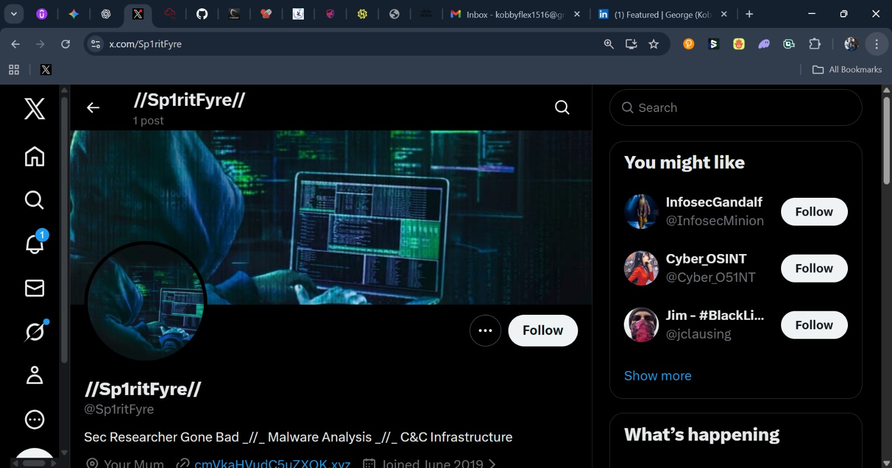
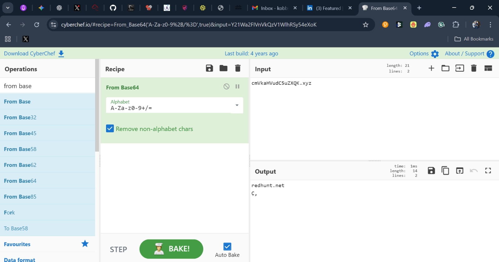
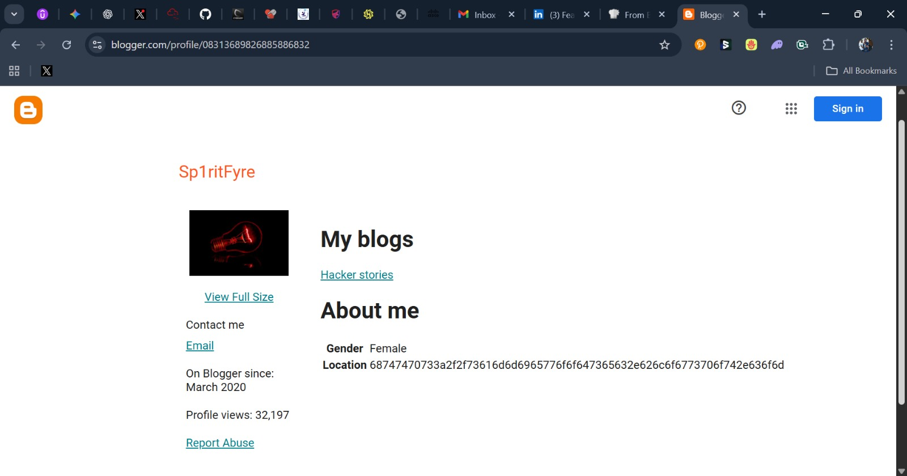

# 🕵️‍♀️ OSINT Investigation: Operation Sp1ritFyre


## 📌 Project Overview
**Challenge Context:** CyberHouse Ghana Cyber Sentinels Training  
**Objective:** Conduct Open Source Intelligence (OSINT) investigation on the target `@sp1ritfyre` to uncover their digital footprint, identity, and potential ties to malicious activity.

This scenario simulates a real-world threat actor profiling exercise involving an MSP (Managed Service Provider) breach.

---

## 🛠️ Tools & Techniques Used
- **Reconnaissance:** Manual Twitter Profiling, Web Correlation  
- **Decoding:** CyberChef (Base64 De-obfuscation)  
- **Search Operations:** Google Dorking & OSINT Search Queries  
- **Attribution:** Username Enumeration, Metadata Correlation  

---

## 🔍 Investigation Walkthrough

### **Phase 1 — Initial Reconnaissance**
The provided starting point was a suspicious Twitter account.

**Target:** `@sp1ritfyre`  
**Observation:**  


---

### **Phase 2 — Decoding & Pivoting**
The profile contained an encoded string. I used **CyberChef** to investigate.

- **Technique:** Base64 Decoding  
- **Input:** `cmVkaHVudC5uZXQK`  
- **Output:** `redhunt.net` (Target’s personal website)



---

### **Phase 3 — Deep Dorking**
Using the discovered domain, I pivoted via Google Dorking.

**Query used:**
```text
"redhunt.net" -site:redhunt.net
```
Goal:
Reveal external blogs, accounts, and hidden references tied to the target.

Outcome:
A Blogger profile linked directly to the target's personal alias.



| Attribute              | Details Identified                           |
| ---------------------- | -------------------------------------------- |
| **Real Name**          | Sammie Woods                                 |
| **Alias**              | Sp1ritFyre                                   |
| **Location**           | United Kingdom                               |
| **Occupation**         | Junior Penetration Tester                    |
| **Email**              | `d1ved33p@gmail.com`                         |
| **Malicious Activity** | Connected to MSP breach & leaked credentials |

---
🧠 Skills Demonstrated
Digital Footprinting: Mapping identity across platforms

De-obfuscation: Base64 decoding & data interpretation

Pivot Logic: Using small clues to build a large profile

Report Writing: Structuring a professional OSINT summary

⚠️ Disclaimer

This investigation was carried out as part of a cybersecurity training challenge.
All individuals, emails, and data referenced are fictional and created solely for educational purposes.
No real-world persons were targeted or harmed.
